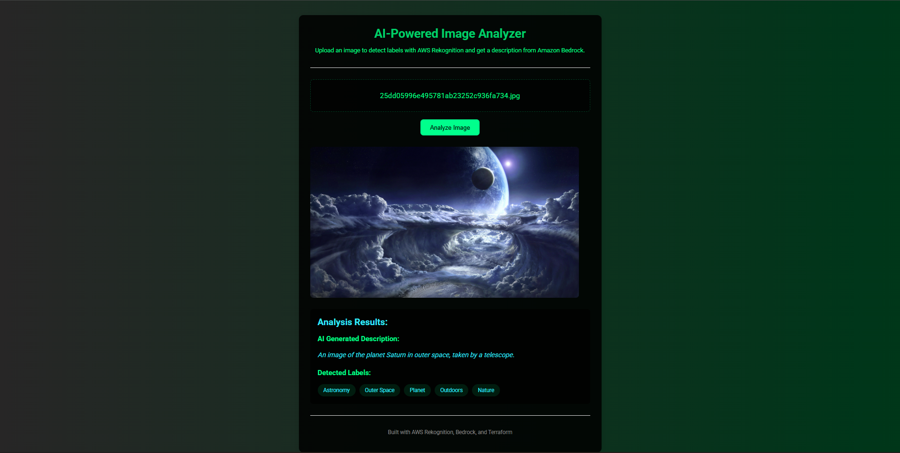

# AI Image Analyzer

## Description
This project is a web application that uses AWS and AI services to analyze images to create tags and descriptions. I used Amazon Rekoginition to detect objects in an image, and Amazon Bedrock to convert labels into descriptive texts. I used AWS Lambda to process requests, and Amazon API Gateway to expose the backend via a RESTful API. I hosted the frontend on Amazon S3. I automated the setup and deployment of all AWS resources with Terraform.
## Installation

No specific installation steps are required for this project.

## Usage

This webpage can be used to create a description of an image after being analyzed by AI.

## Credits

This project was independently developed.

## License

Please refer to the license file included in the repo.

---
